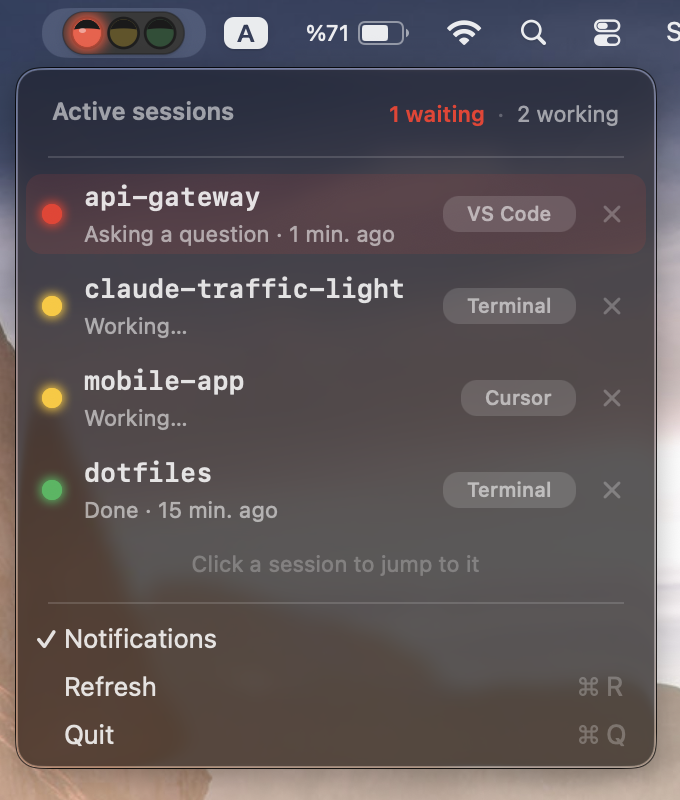
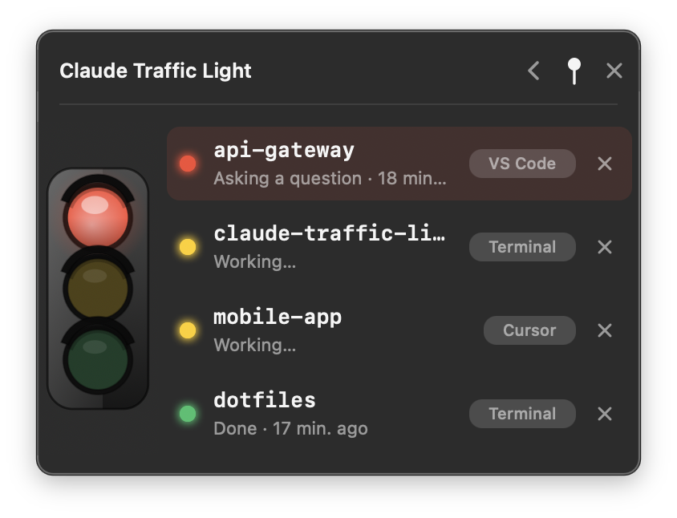
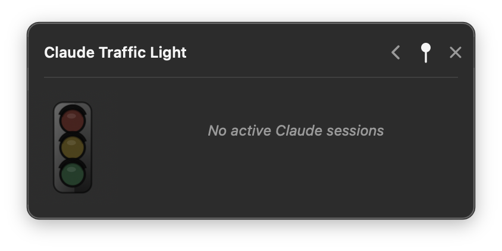
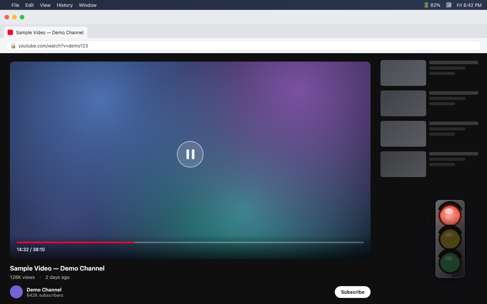

# Claude Traffic Light 🚦

> A tiny traffic-light indicator for [Claude Code](https://claude.com/claude-code)
> sessions — always visible in your **macOS menu bar** or **Windows system tray**,
> so you know at a glance whether Claude is working, done, or waiting on you.

<p align="center">
  <a href="LICENSE"></a>
  
  
</p>

- 🟡 **Yellow** — Claude is working / writing code
- 🔴 **Red** — Claude asked a question, needs permission, or is waiting for you
- 🟢 **Green** — Claude finished, it's your turn
- ⚫ **Off** — no active sessions

With multiple Claude sessions open, the icon shows the **most attention-worthy**
state (priority: **red > yellow > green**). Click it to see every session on its own
row, and click a row to jump straight to that chat (VS Code / Cursor / terminal /
Claude desktop). When a session turns red, you get a native notification.

**No network, no tokens, no telemetry** — it only reads local
`~/.claude/status/*.json` files that Claude Code hooks write. Fully offline,
with one explicit exception: the **Check for Updates…** menu item, which — only
when you click it — asks the GitHub Releases API for the latest version and
opens the release page if there is a newer one. Nothing runs automatically. The
macOS and Windows apps share the exact same status contract, so they behave
identically and can even run side by side.

---

## 📸 Screenshots

<table>
<tr>
<td align="center" width="33%">
<br>
<sub>Menu bar — click the light to see every session</sub>
</td>
<td align="center" width="33%">
<br>
<sub>Floating widget — same list, pinnable anywhere on screen</sub>
</td>
<td align="center" width="33%">
<br>
<sub>Floating widget — idle, no active sessions</sub>
</td>
</tr>
</table>

Pin the widget and collapse it down to just the light — it stays **always on top**,
so you can keep an eye on Claude while you're watching a video, browsing, or in any
other app, and glance over the moment it turns red.

<p align="center">
<br>
<sub>Collapsed and pinned on top — track Claude while you watch, browse, or work on anything else</sub>
</p>

---

## ⬇️ Download & install

All ready-to-run builds are published on the
**[Releases page »](https://github.com/merve/claude-traffic-light/releases/latest)**.
Pick your platform below.

### 🍎 macOS

1. Download **`ClaudeTrafficLightMenuBar.dmg`** from the
   [latest release](https://github.com/merve/claude-traffic-light/releases/latest).
2. Open the DMG and drag **Claude Traffic Light** into **Applications**.
3. Launch it. On first run it self-installs the Claude Code hook, sets up
   launch-at-login, and the traffic light appears in your menu bar.

_(Optional)_ **`ClaudeTrafficWidget.dmg`** adds a draggable, pinnable floating
widget with a live session list — install it the same way. It's a read-only
viewer, so it needs the menu-bar app installed at least once first (that's what
sets up the hook). Runs fine alongside the menu-bar app, or standalone.

> **Gatekeeper note:** both apps are unsigned. On first open, macOS may say
> _"Apple cannot check it for malicious software."_ Go to **System Settings →
> Privacy & Security → Open Anyway**, or run
> `xattr -dr com.apple.quarantine "/Applications/<app name>.app"`.

**Prefer to build from source?** See the [macOS guide »](macos/README.md) —
one command: `cd macos && ./install.sh`.

### 🪟 Windows

Two independent builds — grab either or both from the
[latest release](https://github.com/merve/claude-traffic-light/releases/latest).
Both are **self-contained** (no .NET install required).

- **`ClaudeTrafficLightTrayApp.exe`** — the **system-tray** traffic light (recommended).
- **`ClaudeTrafficWidget.exe`** — an optional **always-on-top desktop widget** you
  can drag anywhere on screen.

Install:

1. Put the `.exe`(s) in a **permanent** folder, e.g.
   `%LOCALAPPDATA%\ClaudeTrafficLight\` (don't leave them on the Desktop — moving
   them later breaks autostart).
2. Double-click **`ClaudeTrafficLightTrayApp.exe`**. On first run it self-installs the
   Claude Code hook (backs up `settings.json` first) and registers autostart. The
   light shows up near the clock (bottom-right). If hidden, click the **^** arrow.
3. _(Optional)_ Double-click **`ClaudeTrafficWidget.exe`** for the desktop widget.

> **SmartScreen note:** the exe is unsigned, so Windows may warn on first run.
> Choose **More info → Run anyway**.

**Full details & build-from-source:** [Windows guide »](windows/README.md).

---

## 🔧 How it works

Two pieces, on both platforms:

1. **A Claude Code hook** fires on session events (`UserPromptSubmit`, `PreToolUse`,
   `PermissionRequest`, `Stop`, …) and writes a per-session status file to
   `~/.claude/status/<session_id>.json`.
2. **The tray / menu-bar app** reads those files about once a second and updates the
   traffic light, collapsing multiple sessions to the highest-priority color.

| Claude Code event                                 | Meaning           |   Color   |
| ------------------------------------------------- | ----------------- | :-------: |
| `UserPromptSubmit`, `PreToolUse`, `PostToolUse`   | Working           |    🟡     |
| `PostToolUseFailure`, `PermissionDenied`          | Working (tool failed / denied → Claude continues) | 🟡 |
| `PreToolUse` (`AskUserQuestion` / `ExitPlanMode`) | Waiting on you    |    🔴     |
| `PermissionRequest`, `Notification`*              | Waiting on you    |    🔴     |
| `SubagentStart`                                   | Working (background agent running) | 🟡 |
| `SubagentStop`                                    | Unchanged — only clears the agent from the active set | — |
| `Stop`, `StopFailure`                             | Response finished |    🟢     |
| `Stop` (a background subagent is still running)** | Working           |    🟡     |
| `Stop` (reply ends with a blocking question)      | Waiting on you    |    🔴     |
| `Stop` (courtesy closer: "anything else?")        | Response finished |    🟢     |
| `SessionEnd`                                      | Session ended     | (removed) |

\* `Notification` is filtered by an allowlist that's deliberately inverted: only
the types that genuinely mean "waiting on you" (`permission_prompt`,
`elicitation_dialog`, `agent_needs_input`, mid-turn idle) go red, elicitation
completion goes back to yellow, and **everything else — including an unknown or
missing type — repaints nothing at all.** That way a future notification type
(or an older Claude Code version where the field never arrives) can never light
a false red mid-turn; a real permission wait already goes red via the separate
`PermissionRequest` event either way.

\** A background subagent finishing its own turn used to paint the shared
session green (its `Stop`) even while the user's actual request was still
running, then flip back yellow on the next tool call — visible flicker that
told the user "done" while work continued. The light now tracks active
subagent ids and stays yellow through the real `Stop` while any are still
running (a detected question always outranks this and still goes red).

When a chat closes, the app notices its process is gone, drops the row, and deletes
the stale status file — so the list stays clean.

**Red-trust gate.** Red means "a question is visible in a chat you are actually in".
When an IDE window reloads, its extension silently resumes old sessions in the
background; the resumed process immediately re-fires the pending-question
`Notification`, which would light a red you can never find or answer. The hook
grants trust only to an event that actually proves you're present: you just typed
(`UserPromptSubmit`), the session has a visible terminal (a controlling tty /
console) or is the always-visible Claude desktop app, or the previous write from
the same process was already trusted. Anything else keeps whatever trust it had
before (untrusted by default); an untrusted red is recorded as green.

## 🌍 Languages

The UI localizes to your **system language** and falls back to **English**.
Built-in: English, Turkish, Spanish, German, French, Italian, Portuguese, Russian,
Japanese, Chinese (Simplified), Korean. Adding one is a single table entry — see the
platform READMEs.

## 🗂️ Repository layout

```
.
├─ macos/               Swift menu-bar app (SwiftPM) + optional floating widget + install/build scripts
├─ windows/             .NET 9 tray app + optional desktop widget (WinForms)
├─ assets/screenshots/  README images
├─ CONTRIBUTING.md
├─ CODE_OF_CONDUCT.md
├─ SECURITY.md
├─ LICENSE              MIT
└─ README.md            you are here
```

Each platform folder has its own README with build, test, and development notes:

- **macOS** → [`macos/README.md`](macos/README.md)
- **Windows** → [`windows/README.md`](windows/README.md) ·
  [behavior spec](windows/WINDOWS-PORT-SPEC.md)

## 🤝 Contributing

Contributions are welcome! Please read [CONTRIBUTING.md](CONTRIBUTING.md) first,
and note the [Code of Conduct](CODE_OF_CONDUCT.md). Bug reports and feature
requests go in
[Issues](https://github.com/merve/claude-traffic-light/issues) — found a
**security** issue instead? See [SECURITY.md](SECURITY.md) rather than opening a public issue.

## 📄 License

[MIT](LICENSE)
